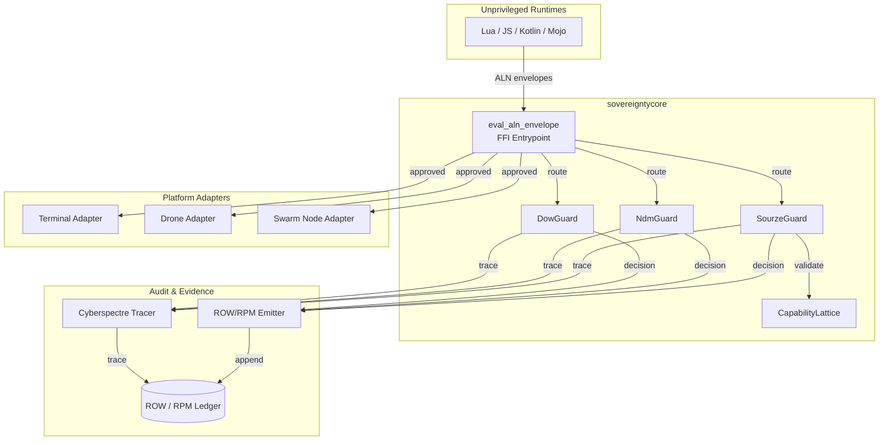

# Sovereignty Core Architecture

## Overview

`sovereigntycore` is the **Enforcement Layer** of the Sovereign Spine, consuming schemas from `aln-syntax-core` and exposing the single privileged function `eval_aln_envelope(bytes) -> bytes`.

## Architecture Diagram

Key Design Principles
Single Entrypoint: All privileged operations go through eval_aln_envelope
No Unsafe Code: Critical paths are memory-safe Rust
Embedded Governance: NDM, eco floors, non-weaponization in code
Offline-First: No network calls required for validation
Full Auditability: Every decision → ROW shard + Cyberspectre trace
Guard Crate Integration
Guard Crate
Schema
Enforcement
SourzeGuard
security.sourze.policy.v1.aln
Capability lattice, non-weapon envelope, eco floor
NdmGuard
security.ndm.v1.aln
Monotone transitions, K-score thresholds
DowGuard
durable.osware.dow.v1.aln
Anti-rollback, sandbox rules
Security Properties
Deterministic: Same input → same output
Reproducible: Build is byte-for-byte reproducible
Verifiable: Hex-stamp attestation on every release
Formally Verified: Guard invariants proven with TLA+/Coq
Document Hex-Stamp: 0x2b3c4d5e6f7a8b9c0d1e2f3a4b5c6d7e8f9a0b1c2d3e4f5a6b7c8d9e0f1a2b3c
Last Updated: 2026-03-04
